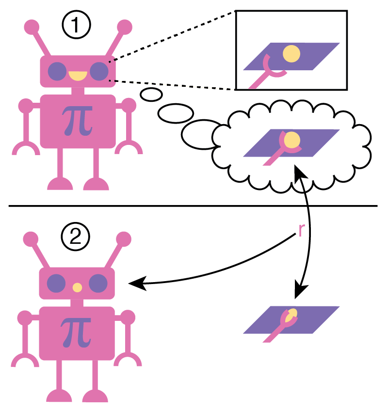
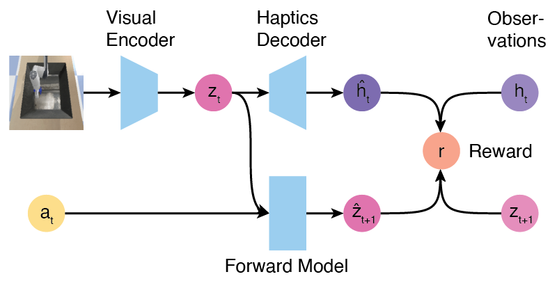

## Overview

We introduce a new method for exploration in robot manipulators. 
We show that this method works well on sparse-reward tasks as pretraining task. 

The paper is available on [OpenReview - https://openreview.net/forum?id=VfGk0ELQ4LC](https://openreview.net/forum?id=VfGk0ELQ4LC) 
and an older version on [arXiv - https://arxiv.org/abs/2104.00442](https://arxiv.org/abs/2104.00442)

Here's the general idea in a little illustration. 

1. The robot learns to associate visual stimuli with expected haptic sensations.
2. The robot is surprised by a haptic sensation feeling different than expected. We use this difference as reward signal 
for exploration. 

---

Here's an outline of our architecture.

## Demo

TODO - we have a little pybullet live demo in progress that'll go here

## Minitouch Benchmark

For this task, we designed a new small interaction benchmark that can be found here:
[MiniTouch - https://github.com/ElementAI/MiniTouch](https://github.com/ElementAI/MiniTouch)

## Paper Code

TODO - the paper code is currently WIP and will be released shortly